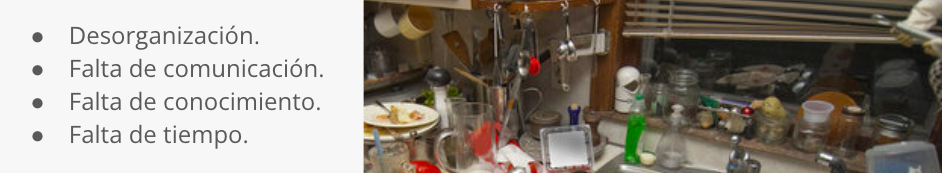

## Indice 

  1. [Descripción del proyecto](#descripcion-del-proyecto) <!-- Descripción del proyecto. Qué hace la aplicación -->
  2. [Tecnologías](#tecnologias) <!-- Tecnologías usadas en el desarrollo -->
  3. [Retos enfrentados y aprendizajes](#retos-enfrentados)<!-- Retos enfrentados -->
  4. [URL](#url)<!-- URL de la aplicación desplegada. -->
  5. [Personas-Desarrolladores del Proyecto](#autores) <!-- Autores -->
  

<h2 align="center" class="descripcion-del-proyecto">Descripción del proyecto</h2>
                   
<h2 align="center" class="tecnologias">Tecnologías</h2>
 

 
<h2 align="center" class="retos-enfrentados">Retos enfrentados y aprendizajes</h2>
 

 
<h2 align="center" class="url">URL</h2>
 
https://huilenpe.github.io/RanDoom/
 
<h2 align="center" class="autores">Autores</h2>
 
| [ Jesus Fajardo](https://github.com/JFCTito) | [ Ariel Paricio](https://github.com/Arielparicio28)| [ Huilen Peña](https://github.com/HuilenPe) | [ Federico Martino](https://github.com/Federicojaviermartino) | [ Trinidad Diez] (https://github.com/trinitytenrabbit) |
| :---: | :---: | :---: | :---: |

<h2 align="center" class="presentacion">Presentación</h2

 [Presentación del proyecto](https://docs.google.com/presentation/d/1gP7s4HxYT8FHZFldJX68DcYnLeX7yIheRLu7BIb8HPU/edit?usp=sharing)
 
