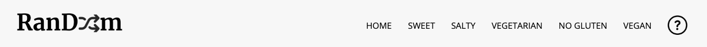

<h1 align="center" font-size=20px>Random recipes one click away!</h1>

## Indice 

  1. [Descripción del proyecto](#descripcion-del-proyecto) <!-- Descripción del proyecto. Qué hace la aplicación -->
  2. [Tecnologías](#tecnologias) <!-- Tecnologías usadas en el desarrollo -->
  3. [Retos enfrentados y aprendizajes](#retos-enfrentados)<!-- Retos enfrentados -->
  4. [URL](#url)<!-- URL de la aplicación desplegada. -->
  5. [Personas-Desarrolladores del Proyecto](#autores) <!-- Autores -->
  

<h2 align="center" class="descripcion-del-proyecto">Descripción del proyecto</h2>

Random es una página web que presenta un listado de comidas y permite a los usuarios elegir una receta aleatoriamente. La página cuenta con un botón "Generar Receta" que selecciona al azar una comida de la lista y muestra tanto la receta como los ingredientes necesarios para prepararla.
 
La lista inicial de comidas se carga al cargar la página y está compuesta por una variedad de recetas previamente ingresadas. Cada vez que se genera una receta aleatoria, esta se elimina automáticamente de la lista, evitando así su repetición.
 
Además, se ha implementado una funcionalidad que permite a los usuarios añadir nuevas recetas a la lista. Junto al listado de comidas, se encuentra un formulario donde los usuarios pueden ingresar el nombre de la receta, su descripción y la lista de ingredientes necesarios. Al enviar el formulario, la nueva receta se agrega a la lista existente y se muestra al usuario como una opción más para generar aleatoriamente.
 
El objetivo de Random es brindar a los usuarios una forma divertida y fácil de descubrir nuevas recetas para sus comidas. La generación aleatoria de recetas evita la monotonía y promueve la exploración de diferentes platos. Además, la posibilidad de añadir nuevas recetas permite a los usuarios compartir sus propias creaciones culinarias con la comunidad, enriqueciendo así la variedad de opciones disponibles.
 
En resumen, Random es una página web interactiva que presenta un listado de comidas, permite generar aleatoriamente una receta y muestra tanto la receta como los ingredientes necesarios para prepararla. Los usuarios también tienen la capacidad de añadir nuevas recetas a la lista. Este proyecto busca promover la diversidad culinaria y fomentar la colaboración entre los usuarios al compartir sus propias recetas.

                   
<h2 align="center" class="tecnologias">Tecnologías</h2>
 

 
<h2 align="center" class="retos-enfrentados">Retos enfrentados y aprendizajes</h2>
 

 
<h2 align="center" class="url">URL</h2>
 

https://huilenpe.github.io/RanDoom/

 
<h2 align="center" class="autores">Autores</h2>
 

 
<h2 align="center" class="presentacion">Presentación</h2

 [Presentación del proyecto](https://docs.google.com/presentation/d/1gP7s4HxYT8FHZFldJX68DcYnLeX7yIheRLu7BIb8HPU/edit?usp=sharing)
 
 
 

